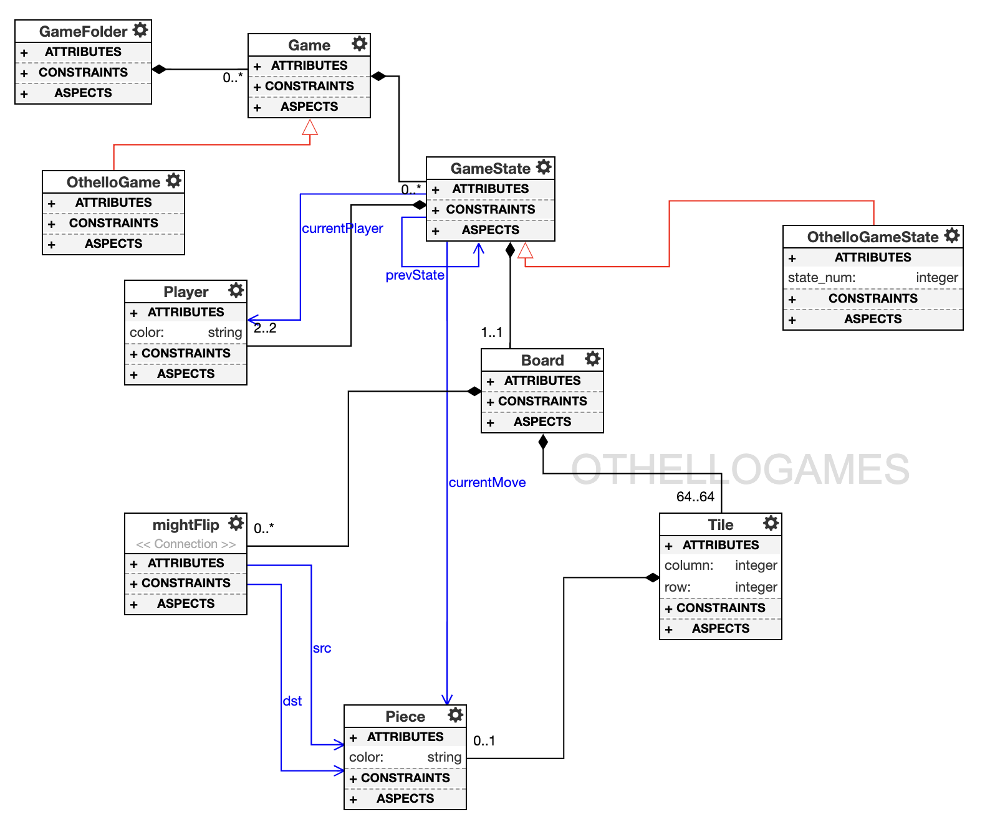

# Othello Design Studio
By Mary Stirling Brown
Fall 2023

## Overview
This repository contains a design studio for an Othello game. Rules can be found here on the [Othello website](https://www.eothello.com). It incorporates many tools working at once: WebGME, ReactJS, Docker, NodeJS, MongoDB, and Python plugins. The design process for this design studio is as follows: 

- First, the metamodel was developed using WebGME, as this serves as the basis for modeling an OthelloGame.
- Plugins were written in Python using the core WebGME API in Python.
- These were first tested locally inside WebGME using containment and composition concepts.
- Next, I used the example [repository](https://github.com/kecso/mic-react-viz) to develop my own visualization tool for a user to be able to play the OthelloGame. This repository was used to help aid me in leaerning ReactJS and how all the pieces and tools work together. All seeds, plugins, and visualizers were created using webgme-cli and docker commands. The visualization is a ReactJS front-end that correctly lets two players complete a full Othello game, with undo functionality as well.
- I implemented a fully-dockerized design studio to minimize any tool or dependencies errors and streamline the development process.


## Dependencies
- Because this is a fully-dockerized design studio, all you need to download beforehand is [Docker-Desktop](https://www.docker.com/products/docker-desktop).

## Deployment
1) Clone the repository:
    ```bash
    git clone https://github.com/marystirling/othello-miniproject.git

1) Edit the '.env' file so that the BASE_DIR variable includes the full path of cloned repository

2) Build the docker container:
   
    ```bash
   docker-compose up -d --build

3) Connect to your server at [http://localhost:8888](http://localhost:8888).

4) Create a new project and seed "Othello".
5) Click on the GameFolder containment.
6) Click on the OthelloGame containment.
7) Enjoy the game!
8) To start a new game, create a new game by following steps 5-7.
## Metamodel
Here is my metamodel for the OthelloGames:



New functionalities introduced in the miniproject:

- The concept of the game: Game Folder contains Game. Game contains GameState. OthelloGame is a specialization of Game. OthelloGameState is a specialization of GameState. This made the visualization be able to correctly visualize all states of an OthelloGame, where a GameFolder can contain many OthelloGames.
- Sequential relationship among game states: The pointer 'prevState' points to the last state played, allowing the undo functionality to work.
- Last placed piece: A GameState has a pointer called currentMove towards Piece.
- Current player: A GameState has a pointer called currentPlayer towards Player.

## Plugins
- BuildDescriptor: This plugin creates the 8x8 representation for the board. It also contains functionalities that include determining any valid tiles that the current player can play on and counting the number of white and black pieces at every game state.
- PlayerMoves: This plugin takes in the position of the tile clicked and the valid tiles list from BuildDescriptor through its configStructure in metadata.json. Utilizing this information, this performs all the flipping for the current player, creates a new game state to represent this, and sets the appropriate pointers to the next current player, piece last placed, and the previous state.
- Undo: This plugin brings the game back to the previous state, which allows the last player to redo their move. It can undo any state, except the initial state when the game begins.
